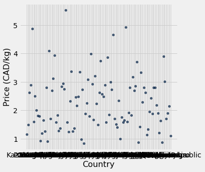
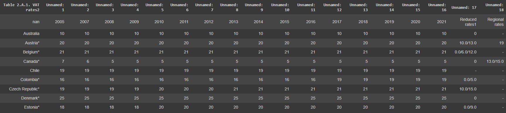
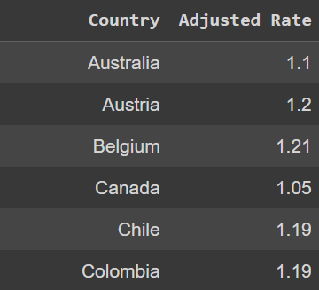
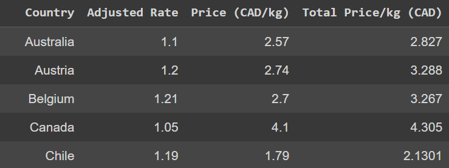
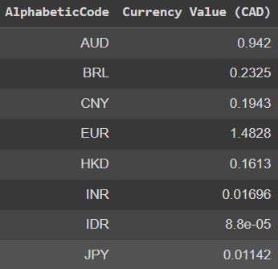
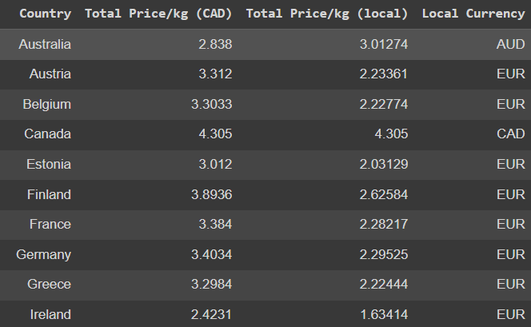
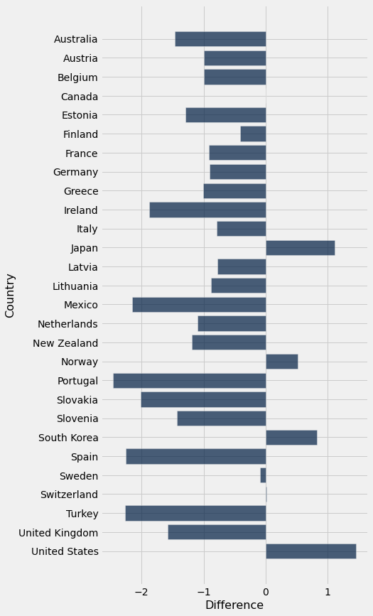
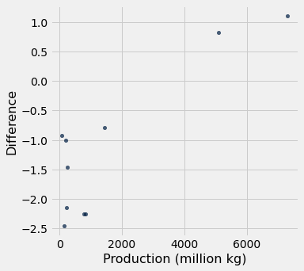

## White Rice Index
## Why

- Staple grain
- Better than brown rice
- Data likely available and extensive

### Source Data

First, I need to get the data for the price of a kg of white rice. I use [Numeo](https://www.numbeo.com/cost-of-living/prices_by_country.jsp?displayCurrency=CAD&itemId=115). I scrape the table on the website.

#### Clean the data

The source data table comes with a `rank` row, which is filled with `nan`. I remove it. I test for duplicate values by `.group()`ing on "Country", and test for non float values in the price column. I scatterplot the data to see if i makes sense and if there are any outliers. 

### Tax rate data

Next, I need data for the sale tax in different countries. I get this data from [OECD](https://www.oecd.org/tax/tax-policy/tax-database/). The file is not a csv, it is an xlsl, so different code is needed to import it.
```python
raw_tax_table = Table.from_df(pd.read_excel(url))
```
The table contains a lot of extra data:



It has data for many years, and extra information about each country. I `select` only the rows for country and 2021 tax rate, and filter for nan values to remove the extra information rows. I also remove the asterisks after the names of some countries, and convert the percentage into a value that can be directly multiplied with price to get the total price with tax. 


Next, I join these two tables by country to make a new table with both the price of white rice and local sales tax rate. I test for missing values in the join by counting the number of rows in the tax rate table vs the joined table. This number goes from `37` to `33`, so the join must have missed some countries.

```python
for country in tax_rate_table_2021[0]:
  if country not in rice_tax_table[0]: print(country)
```
```
Korea
Luxembourg
Slovak Republic
Unweighted average
```
It missed 3 countries and `Unweighted Average`, which should be removed anyway.

I remap `Korea` to `South Korea` and `Slovak Republic` to `Slovakia`, and drop `Luxembourg` because it is not in the prices table. Now I have a combined table of price and tax rate. 

### Currency Data

Up until now, all prices have been in CAD. I need to pull in exchange rate and currency code data. I get currency codes from [this](https://raw.githubusercontent.com/datasets/currency-codes/master/data/codes-all.csv) github file, and clean it by `select`ing the `Entity`, `Currency` and `AlphabeticCode` columns and filtering out invalid countries and expired currencies. I join this table to the previous table by `Country`. The new table now includes the currency code for each country. A similar issue happens where it is missing country names because they are written differently, for example `United States Of America (The)` should be `United States`. I remap these names and the tables are joined into a table with price in CAD and local currency.

### Exchange rate data

Now, I need data on exchange rates. I downloaded them from the Bank Of Canada website, and cleaned the csv file in excel manually because it was formatted strangely. It had two tables of different sizes in it, and that tripped up the parser in python. It also has it's rows and columns in the oppose order from what I need. So, I transpose the table and select non-nan values:

```python
exchange_rate_data = Table().with_columns("AlphabeticCode",
    [string.split("/")[0] for string in raw_exchange_rate_data.labels[1:]],
                                        "Currency Value (CAD)", raw_exchange_rate_data_2021.rows[0][1:])\
    .where("Currency Value (CAD)", lambda x: not np.isnan(x))
```


Now that I have this data, I join the exchange rate table into the table we have created so far. The new table has price in CAD, exchange rate, local currency. Then, I calculate the price in local currency and add that as a new column. The new table with only the useful columns selected:


### Plotting a bar graph

First, I add a new column to the table from `Total Price/kg (CAD)	- canada_price` where `canada_price` is the price of 1kg of rice in Canada. So the column records the difference between the local price and the Canadian price for each country.



As you can see, most countries have cheaper white rice than Canada, but some are more expensive.

### External factor

The external factor I chose was domestic rice production (rice in general, not white rice). I figured that if a country grew more rice locally, it would be cheaper to buy in that country.

I scraped data from [Atlas Big](https://www.atlasbig.com/en-ca/countries-by-rice-production). The resulting table is clened by formatting the numbers and converting from `Tons` to `Million Kg`. Then, the tables are joined. There are only 10 countries in common between the tables.

I plot a scatter plot of `Production` vs `Price Difference`:



And here with the countries labeled:


From the scatterplot, we can see that high producing countries tend to have high prices. However, the reason that there are only 10 countries in the data is because the rest produe approximately zero rice. From Atlas Big:
```
Canada does not produce rice.
```
So, filling in the zero values we see that although it is true that high producing countries tend to have high prices, It is not true that low producing ocuntries have low prices. Canada for example, has expensive rice and no production. Overall, the correlation is not very strong, particularily taking into account the zero values which make up the majority of the data. (~20-30)

## Conclusion

We learned a few things here:
- If you really really like buying rice for cheap, move to Portugal.
- If you really like buying expensive rice, move to the United States
- If a country produces lots of rice, it probably has expensive local prices.
- Most countries produce little or no rice 
- Most countries have cheaper rice than in Canada


